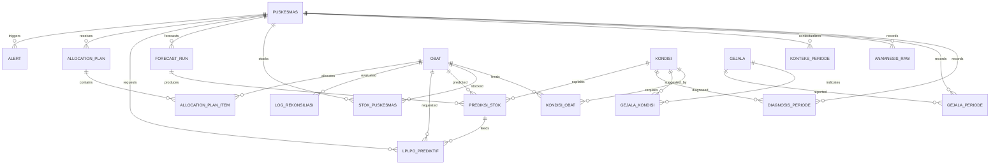

# MaternaLink Problem Research Alignment Implementation Plan

> **For agentic workers:** REQUIRED SUB-SKILL: Use superpowers:subagent-driven-development (recommended) or superpowers:executing-plans to implement this plan task-by-task. Steps use checkbox (`- [ ]`) syntax for tracking.

**Goal:** Improve the existing MaternaLink backend so it reads as a focused Problem Research MVP for DB schema setup, API setup, ERD, Swagger, and demo readiness without forcing the implementation to copy draft PDF tables 1:1.

**Architecture:** Keep the current NestJS/Prisma/PostgreSQL modular backend. Add only domain-critical fields that strengthen the remote maternal healthcare supply-chain story, extend seed data to cover representative clinical/logistics scenarios, improve Swagger documentation, and add a reproducible demo flow. The draft PDFs remain reference material, while the implemented schema is documented as a normalized MVP.

**Tech Stack:** NestJS, TypeScript, Prisma, PostgreSQL, Docker Compose, Swagger/OpenAPI, Jest, Supertest, Mermaid ERD.

---

## File Structure

- Modify `prisma/schema.prisma`: add domain-critical columns to existing models while preserving current table names and relationships.
- Create migration directory under `prisma/migrations/` ending with `_problem_research_alignment`: generated by `pnpm run prisma:migrate -- --name problem_research_alignment`.
- Modify `prisma/seed.ts`: seed remote puskesmas, representative maternal conditions, symptoms, medicines, condition-medicine mappings, symptom-condition mappings, context, and stock rows.
- Modify `src/modules/master/master.dto.ts`: expose new puskesmas and medicine fields in Swagger request DTOs.
- Modify `src/modules/inputs/inputs.dto.ts`: expose new context and anamnesis fields in Swagger request DTOs.
- Modify `src/modules/master/master.controller.ts`, `src/modules/inputs/inputs.controller.ts`, `src/modules/forecast/forecast.controller.ts`, `src/modules/lplpo/lplpo.controller.ts`, `src/modules/distribution/distribution.controller.ts`: add `@ApiOperation` and `@ApiResponse` descriptions.
- Modify `src/modules/master/master.service.ts`: create puskesmas/medicine rows with new fields.
- Modify `src/modules/inputs/inputs.service.ts`: upsert new context fields and save richer anamnesis rows.
- Modify `src/modules/distribution/distribution.service.ts`: include access/cold-chain risk in simulation responses.
- Modify `test/app.e2e-spec.ts`: add tests proving new seed data, context fields, and distribution alerts work.
- Modify `docs/erd/maternalink-erd.mmd`: reflect added fields in lightweight Mermaid notes by grouping entities and relationships.
- Modify `docs/api/openapi-notes.md`: explain Swagger tags, MVP boundaries, and why the schema intentionally differs from draft PDFs.
- Modify `README.md`: add design rationale and exact demo flow.
- Create `docs/demo-flow.md`: copy-pasteable demo script for DB/API/Swagger presentation.

## Domain Boundary

Do not rewrite the schema to match `DATASET DIAGRAM.pdf`, `Master Data.pdf`, or `Rancangan.pdf` 1:1. Treat those PDFs as reference drafts. Implement only the smallest additions that make the backend visibly answer `Problem Research .pdf`: remote puskesmas, maternal medicine forecasting, weather/access disruption, cold chain, LPLPO request, and distribution alert.

---

### Task 1: Add Failing E2E Coverage for Problem Research Scenarios

**Files:**
- Modify: `test/app.e2e-spec.ts`

- [ ] **Step 1: Add tests for richer seed and logistics alerts**

Append these tests inside the existing `describe('MaternaLink API', () => { ... })` block in `test/app.e2e-spec.ts`, after the existing forecast test:

```ts
  it('exposes remote puskesmas logistics metadata from master data', async () => {
    const response = await request(app.getHttpServer()).get('/api/master/puskesmas').expect(200);

    expect(response.body).toEqual(
      expect.arrayContaining([
        expect.objectContaining({
          id: 'PKM-REMOTE-001',
          kabupatenKota: 'Kab. Manggarai',
          provinsi: 'NTT',
          skorAksesibilitas: 1,
          leadTimeHari: 7,
          coldChainReady: false,
        }),
      ]),
    );
  });

  it('stores maternal context fields used by forecast and logistics reasoning', async () => {
    const response = await request(app.getHttpServer())
      .post('/api/inputs/konteks')
      .send({
        puskesmasId: 'PKM-REMOTE-001',
        periode: '2025-04-01',
        season: 'HUJAN',
        accessScore: 1,
        rainyAccess: 'TERGANGGU',
        routeDisrupted: true,
        jumlahBumilT1: 10,
        jumlahBumilT2: 15,
        jumlahBumilT3: 12,
        statusKlb: false,
        riwayatStockout6Bln: { 'OBT-010': 2 },
      })
      .expect(201);

    expect(response.body).toEqual(
      expect.objectContaining({
        puskesmasId: 'PKM-REMOTE-001',
        jumlahBumilT1: 10,
        jumlahBumilT2: 15,
        jumlahBumilT3: 12,
        statusKlb: false,
        riwayatStockout6Bln: { 'OBT-010': 2 },
      }),
    );
  });

  it('simulates route and cold-chain alerts for remote allocation plan', async () => {
    const planResponse = await request(app.getHttpServer())
      .post('/api/distribution/plans')
      .send({
        puskesmasId: 'PKM-REMOTE-001',
        periode: '2025-04-01',
        items: [{ obatId: 'OBT-010', jumlah: 12, note: 'Emergency preeclampsia stock' }],
      })
      .expect(201);

    const simulationResponse = await request(app.getHttpServer())
      .post(`/api/distribution/plans/${planResponse.body.id}/simulate`)
      .expect(201);

    expect(simulationResponse.body.alerts).toEqual(
      expect.arrayContaining([
        expect.objectContaining({ type: 'ROUTE_DISRUPTION', severity: 'HIGH' }),
        expect.objectContaining({ type: 'COLD_CHAIN_MISMATCH', severity: 'CRITICAL' }),
      ]),
    );
  });
```

- [ ] **Step 2: Run tests to verify they fail for the right reason**

Run:

```powershell
pnpm run test:e2e
```

Expected: FAIL. The first test should fail because `kabupatenKota`, `provinsi`, `skorAksesibilitas`, and `leadTimeHari` are not yet present. The second test should fail because `jumlahBumilT1`, `jumlahBumilT2`, `jumlahBumilT3`, `statusKlb`, and `riwayatStockout6Bln` are not yet accepted by validation. The third test should fail because `PKM-REMOTE-001` and richer cold-chain/route risk data are not yet seeded.

- [ ] **Step 3: Commit failing tests**

```powershell
git add test/app.e2e-spec.ts
git commit -m "test: cover problem research logistics scenarios"
```

---

### Task 2: Add Domain-Critical Schema Fields

**Files:**
- Modify: `prisma/schema.prisma`
- Generated: a Prisma migration directory under `prisma/migrations/` ending with `_problem_research_alignment`

- [ ] **Step 1: Extend `Puskesmas` model**

In `prisma/schema.prisma`, replace the current `Puskesmas` scalar fields with this version while keeping existing relation fields unchanged:

```prisma
model Puskesmas {
  id                    String           @id @map("id")
  nama                  String           @unique @map("nama")
  kecamatan             String           @map("kecamatan")
  kabupatenKota         String?          @map("kabupaten_kota")
  provinsi              String?          @map("provinsi")
  tipe                  PuskesmasType    @map("tipe")
  statusEndemisMalaria  Boolean          @default(false) @map("status_endemis_malaria")
  ketersediaanLab       Boolean          @default(false) @map("ketersediaan_lab")
  coldChainReady        Boolean          @default(false) @map("cold_chain_ready")
  kapasitasSimpanObat   Int?             @map("kapasitas_simpan_obat")
  jarakKeIfkKm          Float?           @map("jarak_ke_ifk_km")
  leadTimeHari          Float?           @map("lead_time_hari")
  skorAksesibilitas     Int              @default(2) @map("skor_aksesibilitas")
  rainyAccess           RainyAccess      @default(AMAN) @map("rainy_access")
  createdAt             DateTime         @default(now()) @map("created_at")
  updatedAt             DateTime         @updatedAt @map("updated_at")
  diagnosis             DiagnosisPeriode[]
  gejalaPeriode         GejalaPeriode[]
  anamnesisRaw          AnamnesisRaw[]
  konteksPeriode        KonteksPeriode[]
  stok                  StokPuskesmas[]
  forecastRuns          ForecastRun[]
  lplpo                 LplpoPrediktif[]
  allocationPlans       AllocationPlan[]
  alerts                Alert[]

  @@map("puskesmas")
}
```

- [ ] **Step 2: Extend `Obat` model**

In `prisma/schema.prisma`, add these fields after `satuan` in the `Obat` model:

```prisma
  dosisStandarHarian    Float?               @map("dosis_standar_harian")
  durasiPengobatanHari  Int?                 @map("durasi_pengobatan_hari")
```

- [ ] **Step 3: Extend `KondisiObat` model**

In `prisma/schema.prisma`, replace the scalar fields of `KondisiObat` with:

```prisma
  id                  Int      @id @default(autoincrement()) @map("id")
  kondisiId           String   @map("kondisi_id")
  obatId              String   @map("obat_id")
  dosis               String?  @map("dosis")
  trimesterApplicable String?  @map("trimester_applicable")
  prioritas           Int      @default(1) @map("prioritas")
  catatan             String?  @map("catatan")
```

Keep the existing `kondisi`, `obat`, `@@unique`, and `@@map` lines.

- [ ] **Step 4: Extend `GejalaKondisi` model**

In `prisma/schema.prisma`, add these fields after `bobot` in `GejalaKondisi`:

```prisma
  priorProbability Float?  @map("prior_probability")
  bobotTanpaLab    Float?  @map("bobot_tanpa_lab")
```

- [ ] **Step 5: Extend `AnamnesisRaw` model**

In `prisma/schema.prisma`, replace `teks String @map("teks")` with these fields:

```prisma
  audioPath       String? @map("audio_path")
  transkrip       String  @map("transkrip")
  gejalaExtracted Json?   @map("gejala_extracted")
  gejalaValidated Json?   @map("gejala_validated")
  sttModel        String? @map("stt_model")
  extractionModel String? @map("extraction_model")
```

- [ ] **Step 6: Extend `KonteksPeriode` model**

In `prisma/schema.prisma`, add these fields after `routeDisrupted` in `KonteksPeriode`:

```prisma
  jumlahBumilT1       Int?  @map("jumlah_bumil_t1")
  jumlahBumilT2       Int?  @map("jumlah_bumil_t2")
  jumlahBumilT3       Int?  @map("jumlah_bumil_t3")
  statusKlb           Boolean @default(false) @map("status_klb")
  riwayatStockout6Bln Json? @map("riwayat_stockout_6bln")
```

- [ ] **Step 7: Generate and apply migration**

Run:

```powershell
pnpm run prisma:generate
pnpm run prisma:migrate -- --name problem_research_alignment
```

Expected: Prisma Client generated and a migration directory ending with `_problem_research_alignment` created and applied successfully.

- [ ] **Step 8: Run build to catch type errors before DTO updates**

Run:

```powershell
pnpm run build
```

Expected: FAIL because DTOs/services still use old fields and new Prisma types are not wired. This is acceptable at this checkpoint.

- [ ] **Step 9: Commit schema and migration**

```powershell
git add prisma/schema.prisma prisma/migrations
git commit -m "feat: add problem research schema fields"
```

---

### Task 3: Wire DTOs and Services to New Fields

**Files:**
- Modify: `src/modules/master/master.dto.ts`
- Modify: `src/modules/master/master.service.ts`
- Modify: `src/modules/inputs/inputs.dto.ts`
- Modify: `src/modules/inputs/inputs.service.ts`

- [ ] **Step 1: Update `CreatePuskesmasDto`**

In `src/modules/master/master.dto.ts`, add imports for numeric validators:

```ts
import { IsBoolean, IsEnum, IsInt, IsNumber, IsOptional, IsString, Max, Min } from 'class-validator';
```

Then add these properties to `CreatePuskesmasDto` after `kecamatan`:

```ts
  @ApiPropertyOptional({ example: 'Kab. Manggarai' })
  @IsOptional()
  @IsString()
  kabupatenKota?: string;

  @ApiPropertyOptional({ example: 'NTT' })
  @IsOptional()
  @IsString()
  provinsi?: string;
```

Add these properties after `coldChainReady`:

```ts
  @ApiPropertyOptional({ example: true })
  @IsOptional()
  @IsBoolean()
  statusEndemisMalaria?: boolean;

  @ApiPropertyOptional({ example: false })
  @IsOptional()
  @IsBoolean()
  ketersediaanLab?: boolean;

  @ApiPropertyOptional({ example: 500 })
  @IsOptional()
  @IsInt()
  @Min(0)
  kapasitasSimpanObat?: number;

  @ApiPropertyOptional({ example: 85.5 })
  @IsOptional()
  @IsNumber()
  @Min(0)
  jarakKeIfkKm?: number;

  @ApiPropertyOptional({ example: 7 })
  @IsOptional()
  @IsNumber()
  @Min(0)
  leadTimeHari?: number;

  @ApiPropertyOptional({ example: 1, minimum: 1, maximum: 3 })
  @IsOptional()
  @IsInt()
  @Min(1)
  @Max(3)
  skorAksesibilitas?: number;
```

- [ ] **Step 2: Update `CreateObatDto`**

In `src/modules/master/master.dto.ts`, add these properties to `CreateObatDto` after `satuan`:

```ts
  @ApiPropertyOptional({ example: 3 })
  @IsOptional()
  @IsNumber()
  @Min(0)
  dosisStandarHarian?: number;

  @ApiPropertyOptional({ example: 14 })
  @IsOptional()
  @IsInt()
  @Min(0)
  durasiPengobatanHari?: number;
```

- [ ] **Step 3: Update context DTO**

In `src/modules/inputs/inputs.dto.ts`, change the import line to:

```ts
import { IsBoolean, IsDateString, IsEnum, IsInt, IsObject, IsOptional, IsString, Min } from 'class-validator';
```

Add these properties to `KonteksInputDto` after `routeDisrupted`:

```ts
  @ApiProperty({ example: 10, required: false })
  @IsOptional()
  @IsInt()
  @Min(0)
  jumlahBumilT1?: number;

  @ApiProperty({ example: 15, required: false })
  @IsOptional()
  @IsInt()
  @Min(0)
  jumlahBumilT2?: number;

  @ApiProperty({ example: 12, required: false })
  @IsOptional()
  @IsInt()
  @Min(0)
  jumlahBumilT3?: number;

  @ApiProperty({ example: false, required: false })
  @IsOptional()
  @IsBoolean()
  statusKlb?: boolean;

  @ApiProperty({ example: { 'OBT-010': 2 }, required: false })
  @IsOptional()
  @IsObject()
  riwayatStockout6Bln?: Record<string, number>;
```

- [ ] **Step 4: Update anamnesis DTO**

In `src/modules/inputs/inputs.dto.ts`, replace `AnamnesisInputDto` with:

```ts
export class AnamnesisInputDto {
  @ApiProperty({ example: 'PKM-001' }) @IsString() puskesmasId!: string;
  @ApiProperty({ example: '2025-03-01' }) @IsDateString() periode!: string;
  @ApiProperty({ example: '/audio/pkm001_202504_001.webm', required: false }) @IsOptional() @IsString() audioPath?: string;
  @ApiProperty({ example: 'Ibu hamil mengeluh lemas dan pusing.' }) @IsString() transkrip!: string;
  @ApiProperty({ example: { gejala: 'Demam tinggi', confidence: 0.95 }, required: false }) @IsOptional() @IsObject() gejalaExtracted?: Record<string, unknown>;
  @ApiProperty({ example: { gejala: 'Demam tinggi', confirmed: true }, required: false }) @IsOptional() @IsObject() gejalaValidated?: Record<string, unknown>;
  @ApiProperty({ example: 'whisper-small', required: false }) @IsOptional() @IsString() sttModel?: string;
  @ApiProperty({ example: 'bert-ner-symptom', required: false }) @IsOptional() @IsString() extractionModel?: string;
}
```

- [ ] **Step 5: Update input service mapping**

In `src/modules/inputs/inputs.service.ts`, replace `createKonteks` with:

```ts
  createKonteks(data: KonteksInputDto) {
    return this.prisma.konteksPeriode.upsert({
      where: { puskesmasId_periode: { puskesmasId: data.puskesmasId, periode: toDate(data.periode) } },
      update: {
        season: data.season,
        accessScore: data.accessScore,
        rainyAccess: data.rainyAccess,
        routeDisrupted: data.routeDisrupted,
        jumlahBumilT1: data.jumlahBumilT1,
        jumlahBumilT2: data.jumlahBumilT2,
        jumlahBumilT3: data.jumlahBumilT3,
        statusKlb: data.statusKlb ?? false,
        riwayatStockout6Bln: data.riwayatStockout6Bln,
      },
      create: { ...data, periode: toDate(data.periode), statusKlb: data.statusKlb ?? false },
    });
  }
```

Replace `createAnamnesis` with:

```ts
  createAnamnesis(data: AnamnesisInputDto) {
    return this.prisma.anamnesisRaw.create({ data: { ...data, periode: toDate(data.periode) } });
  }
```

- [ ] **Step 6: Run build**

Run:

```powershell
pnpm run build
```

Expected: PASS.

- [ ] **Step 7: Run e2e tests**

Run:

```powershell
pnpm run test:e2e
```

Expected: still FAIL until seed is expanded in Task 4.

- [ ] **Step 8: Commit DTO and service wiring**

```powershell
git add src/modules/master/master.dto.ts src/modules/master/master.service.ts src/modules/inputs/inputs.dto.ts src/modules/inputs/inputs.service.ts
git commit -m "feat: expose problem research fields in api inputs"
```

---

### Task 4: Expand Seed Data for Presentation-Grade Domain Coverage

**Files:**
- Modify: `prisma/seed.ts`

- [ ] **Step 1: Replace puskesmas seed block**

Replace the current single `PKM-001` upsert in `prisma/seed.ts` with this array-driven seed:

```ts
  const puskesmasRows = [
    {
      id: 'PKM-001',
      nama: 'Puskesmas MaternaLink 001',
      kecamatan: 'Umbulharjo',
      kabupatenKota: 'Kota Yogyakarta',
      provinsi: 'DI Yogyakarta',
      tipe: 'RAWAT_INAP' as const,
      rainyAccess: 'AMAN' as const,
      coldChainReady: true,
      statusEndemisMalaria: false,
      ketersediaanLab: true,
      kapasitasSimpanObat: 1200,
      jarakKeIfkKm: 8,
      leadTimeHari: 1,
      skorAksesibilitas: 3,
    },
    {
      id: 'PKM-REMOTE-001',
      nama: 'Puskesmas Lembah Sari',
      kecamatan: 'Satarmese',
      kabupatenKota: 'Kab. Manggarai',
      provinsi: 'NTT',
      tipe: 'NON_RAWAT_INAP' as const,
      rainyAccess: 'TERGANGGU' as const,
      coldChainReady: false,
      statusEndemisMalaria: true,
      ketersediaanLab: false,
      kapasitasSimpanObat: 500,
      jarakKeIfkKm: 85.5,
      leadTimeHari: 7,
      skorAksesibilitas: 1,
    },
  ];

  for (const row of puskesmasRows) {
    await prisma.puskesmas.upsert({
      where: { id: row.id },
      update: row,
      create: row,
    });
  }
```

- [ ] **Step 2: Replace conditions seed list**

Replace the `conditions` constant with:

```ts
  const conditions = [
    ['K01', 'Malaria'],
    ['K02', 'Anemia Kehamilan'],
    ['K03', 'Hipertensi / Preeklampsia'],
    ['K04', 'Diabetes Gestasional'],
    ['K05', 'Infeksi Saluran Kemih'],
    ['K06', 'Infeksi Vagina'],
    ['K11', 'ISPA / Pneumonia'],
    ['K12', 'Depresi / Kecemasan Antenatal'],
    ['K13', 'Heartburn / GERD'],
    ['K14', 'Konstipasi / Wasir'],
  ] as const;
```

- [ ] **Step 3: Replace symptoms seed list**

Replace the `symptoms` constant with:

```ts
  const symptoms = [
    ['G01', 'Demam tinggi'],
    ['G02', 'Menggigil'],
    ['G03', 'Mual / muntah berlebihan'],
    ['G04', 'Lemas / mudah lelah ekstrem'],
    ['G05', 'Pusing / sakit kepala berat'],
    ['G06', 'Bengkak wajah / kaki'],
    ['G07', 'Nyeri / panas saat kencing'],
    ['G09', 'Penglihatan kabur'],
    ['G11', 'Sesak napas'],
    ['G15', 'Susah BAB / perut kembung'],
  ] as const;
```

- [ ] **Step 4: Replace medicines seed list and upsert**

Replace the `medicines` constant and medicine loop with:

```ts
  const medicines = [
    ['OBT-001', 'Kina', 'OBAT', 'TABLET', false, 3, 7],
    ['OBT-002', 'Klindamisin', 'OBAT', 'KAPSUL', false, 3, 7],
    ['OBT-003', 'ACT (Artemisinin Combination Therapy)', 'OBAT', 'TABLET', false, 4, 3],
    ['OBT-004', 'Fe dosis tinggi', 'OBAT', 'TABLET', false, 1, 30],
    ['OBT-008', 'Nifedipin', 'OBAT', 'TABLET', false, 2, 30],
    ['OBT-009', 'Metildopa', 'OBAT', 'TABLET', false, 2, 30],
    ['OBT-010', 'MgSO4 (Magnesium Sulfat)', 'OBAT', 'INJEKSI', true, 1, 1],
    ['OBT-013', 'Amoksisilin', 'OBAT', 'KAPSUL', false, 3, 7],
    ['OBT-024', 'Parasetamol', 'OBAT', 'TABLET', false, 3, 5],
    ['OBT-028', 'Laktulosa', 'OBAT', 'CAIRAN', false, 1, 7],
  ] as const;

  for (const [id, nama, kategori, tipe, perluColdChain, dosisStandarHarian, durasiPengobatanHari] of medicines) {
    await prisma.obat.upsert({
      where: { id },
      update: { nama, kategori, tipe, perluColdChain, dosisStandarHarian, durasiPengobatanHari },
      create: { id, nama, kategori, tipe, perluColdChain, satuan: 'unit', dosisStandarHarian, durasiPengobatanHari },
    });
  }
```

- [ ] **Step 5: Replace mapping seed with multiple representative mappings**

Replace the current single `kondisiObat` and `gejalaKondisi` upserts with:

```ts
  const conditionMedicineRows = [
    ['K01', 'OBT-001', '3 tablet per hari', 'T1', 1, 'Malaria trimester awal'],
    ['K01', 'OBT-003', '4 tablet per hari', 'T2,T3', 1, 'Malaria trimester lanjut'],
    ['K02', 'OBT-004', '1 tablet per hari', 'T1,T2,T3', 1, 'Anemia berat'],
    ['K03', 'OBT-008', '2 tablet per hari', 'T2,T3', 1, 'Hipertensi kehamilan'],
    ['K03', 'OBT-010', 'sesuai protokol kegawatdaruratan', 'T2,T3', 1, 'Preeklampsia berat atau kejang'],
    ['K05', 'OBT-013', '3 kapsul per hari', 'T1,T2,T3', 1, 'ISK maternal'],
  ] as const;

  for (const [kondisiId, obatId, dosis, trimesterApplicable, prioritas, catatan] of conditionMedicineRows) {
    await prisma.kondisiObat.upsert({
      where: { kondisiId_obatId: { kondisiId, obatId } },
      update: { dosis, trimesterApplicable, prioritas, catatan },
      create: { kondisiId, obatId, dosis, trimesterApplicable, prioritas, catatan },
    });
  }

  const symptomConditionRows = [
    ['G01', 'K01', 3, 0.6, 0.8],
    ['G02', 'K01', 3, 0.5, 0.7],
    ['G04', 'K02', 2, 0.4, 0.6],
    ['G05', 'K03', 2, 0.4, 0.6],
    ['G06', 'K03', 3, 0.6, 0.8],
    ['G07', 'K05', 3, 0.7, 0.7],
  ] as const;

  for (const [gejalaId, kondisiId, bobot, priorProbability, bobotTanpaLab] of symptomConditionRows) {
    await prisma.gejalaKondisi.upsert({
      where: { gejalaId_kondisiId: { gejalaId, kondisiId } },
      update: { bobot, priorProbability, bobotTanpaLab },
      create: { gejalaId, kondisiId, bobot, priorProbability, bobotTanpaLab },
    });
  }
```

- [ ] **Step 6: Add remote stock and context rows**

After the existing `stokPuskesmas.upsert` for `PKM-001`, add:

```ts
  await prisma.konteksPeriode.upsert({
    where: { puskesmasId_periode: { puskesmasId: 'PKM-REMOTE-001', periode: new Date('2025-04-01') } },
    update: {
      season: 'HUJAN',
      accessScore: 1,
      rainyAccess: 'TERGANGGU',
      routeDisrupted: true,
      jumlahBumilT1: 10,
      jumlahBumilT2: 15,
      jumlahBumilT3: 12,
      statusKlb: false,
      riwayatStockout6Bln: { 'OBT-010': 2 },
    },
    create: {
      puskesmasId: 'PKM-REMOTE-001',
      periode: new Date('2025-04-01'),
      season: 'HUJAN',
      accessScore: 1,
      rainyAccess: 'TERGANGGU',
      routeDisrupted: true,
      jumlahBumilT1: 10,
      jumlahBumilT2: 15,
      jumlahBumilT3: 12,
      statusKlb: false,
      riwayatStockout6Bln: { 'OBT-010': 2 },
    },
  });

  await prisma.stokPuskesmas.upsert({
    where: {
      puskesmasId_obatId_periode: {
        puskesmasId: 'PKM-REMOTE-001',
        obatId: 'OBT-010',
        periode: new Date('2025-04-01'),
      },
    },
    update: { stokAwal: 15, konsumsiPeriode: 12, stokSaatIni: 3 },
    create: {
      puskesmasId: 'PKM-REMOTE-001',
      obatId: 'OBT-010',
      periode: new Date('2025-04-01'),
      stokAwal: 15,
      konsumsiPeriode: 12,
      stokSaatIni: 3,
    },
  });
```

- [ ] **Step 7: Run seed**

Run:

```powershell
pnpm run prisma:seed
```

Expected: seed executes successfully and remains idempotent on a second run.

- [ ] **Step 8: Run e2e tests**

Run:

```powershell
pnpm run test:e2e
```

Expected: the first two new tests pass. The third may still fail until distribution simulation logic is enhanced in Task 5.

- [ ] **Step 9: Commit seed expansion**

```powershell
git add prisma/seed.ts
git commit -m "feat: seed problem research demo data"
```

---

### Task 5: Make Distribution Simulation Explain Route and Cold-Chain Risk

**Files:**
- Modify: `src/modules/distribution/distribution.service.ts`

- [ ] **Step 1: Replace `simulate` with risk-aware response**

Replace the existing `simulate` method in `src/modules/distribution/distribution.service.ts` with:

```ts
  async simulate(id: number) {
    const plan = await this.prisma.allocationPlan.update({
      where: { id },
      data: { status: 'SIMULATED' },
      include: { puskesmas: true, items: { include: { obat: true } } },
    });
    const alerts = [];
    const routeRisk = plan.puskesmas.rainyAccess === 'TERGANGGU' || plan.puskesmas.rainyAccess === 'TERBATAS';

    if (routeRisk) {
      alerts.push(
        await this.prisma.alert.create({
          data: {
            puskesmasId: plan.puskesmasId,
            type: 'ROUTE_DISRUPTION',
            severity: 'HIGH',
            message: `Rainy-season access risk for ${plan.puskesmas.nama}; lead time ${plan.puskesmas.leadTimeHari ?? 0} days`,
          },
        }),
      );
    }

    for (const item of plan.items) {
      if (item.obat.perluColdChain && !plan.puskesmas.coldChainReady) {
        alerts.push(
          await this.prisma.alert.create({
            data: {
              puskesmasId: plan.puskesmasId,
              type: 'COLD_CHAIN_MISMATCH',
              severity: 'CRITICAL',
              message: `${item.obatId} requires cold chain but ${plan.puskesmas.nama} is not cold-chain ready`,
            },
          }),
        );
      }
    }

    return {
      plan,
      riskSummary: {
        rainyAccess: plan.puskesmas.rainyAccess,
        skorAksesibilitas: plan.puskesmas.skorAksesibilitas,
        leadTimeHari: plan.puskesmas.leadTimeHari,
        coldChainReady: plan.puskesmas.coldChainReady,
        alertCount: alerts.length,
      },
      alerts,
    };
  }
```

- [ ] **Step 2: Run e2e tests**

Run:

```powershell
pnpm run test:e2e
```

Expected: PASS, including route and cold-chain alert test.

- [ ] **Step 3: Run build**

Run:

```powershell
pnpm run build
```

Expected: PASS.

- [ ] **Step 4: Commit simulation improvement**

```powershell
git add src/modules/distribution/distribution.service.ts
git commit -m "feat: explain distribution risk simulation"
```

---

### Task 6: Improve Swagger Documentation

**Files:**
- Modify: `src/modules/master/master.controller.ts`
- Modify: `src/modules/inputs/inputs.controller.ts`
- Modify: `src/modules/forecast/forecast.controller.ts`
- Modify: `src/modules/lplpo/lplpo.controller.ts`
- Modify: `src/modules/distribution/distribution.controller.ts`
- Modify: `docs/api/openapi-notes.md`

- [ ] **Step 1: Add Swagger imports to controllers**

For each controller file, change `import { ApiTags } from '@nestjs/swagger';` to:

```ts
import { ApiOperation, ApiResponse, ApiTags } from '@nestjs/swagger';
```

- [ ] **Step 2: Add master controller operation docs**

In `src/modules/master/master.controller.ts`, add decorators above each route method:

```ts
  @ApiOperation({ summary: 'List puskesmas master data with logistics metadata' })
  @ApiResponse({ status: 200, description: 'Puskesmas list returned' })
  @Get('puskesmas')
```

```ts
  @ApiOperation({ summary: 'Create puskesmas master data' })
  @ApiResponse({ status: 201, description: 'Puskesmas created' })
  @Post('puskesmas')
```

```ts
  @ApiOperation({ summary: 'List medicine master data' })
  @ApiResponse({ status: 200, description: 'Medicine list returned' })
  @Get('obat')
```

```ts
  @ApiOperation({ summary: 'Create medicine master data' })
  @ApiResponse({ status: 201, description: 'Medicine created' })
  @Post('obat')
```

```ts
  @ApiOperation({ summary: 'List clinical conditions' })
  @ApiResponse({ status: 200, description: 'Condition list returned' })
  @Get('kondisi')
```

```ts
  @ApiOperation({ summary: 'List maternal symptoms' })
  @ApiResponse({ status: 200, description: 'Symptom list returned' })
  @Get('gejala')
```

- [ ] **Step 3: Add concise operation docs to remaining controllers**

Add one `@ApiOperation` and one `@ApiResponse` above every route method in `inputs`, `forecast`, `lplpo`, and `distribution`. Use these exact summaries:

```ts
@ApiOperation({ summary: 'Upsert monthly diagnosis input' })
@ApiResponse({ status: 201, description: 'Diagnosis input saved' })
```

```ts
@ApiOperation({ summary: 'Upsert monthly symptom input' })
@ApiResponse({ status: 201, description: 'Symptom input saved' })
```

```ts
@ApiOperation({ summary: 'Upsert monthly puskesmas context input' })
@ApiResponse({ status: 201, description: 'Context input saved' })
```

```ts
@ApiOperation({ summary: 'Upsert monthly medicine stock input' })
@ApiResponse({ status: 201, description: 'Stock input saved' })
```

```ts
@ApiOperation({ summary: 'Create raw anamnesis transcript input' })
@ApiResponse({ status: 201, description: 'Anamnesis input saved' })
```

```ts
@ApiOperation({ summary: 'Run deterministic stock forecast' })
@ApiResponse({ status: 201, description: 'Forecast run created with prediction rows' })
```

```ts
@ApiOperation({ summary: 'List forecast runs' })
@ApiResponse({ status: 200, description: 'Forecast runs returned' })
```

```ts
@ApiOperation({ summary: 'Get forecast result rows by run ID' })
@ApiResponse({ status: 200, description: 'Forecast result returned' })
```

```ts
@ApiOperation({ summary: 'Generate predictive LPLPO request from latest forecast' })
@ApiResponse({ status: 201, description: 'LPLPO rows generated' })
```

```ts
@ApiOperation({ summary: 'List predictive LPLPO rows' })
@ApiResponse({ status: 200, description: 'LPLPO rows returned' })
```

```ts
@ApiOperation({ summary: 'List distribution alerts' })
@ApiResponse({ status: 200, description: 'Alerts returned' })
```

```ts
@ApiOperation({ summary: 'Create allocation plan' })
@ApiResponse({ status: 201, description: 'Allocation plan created' })
```

```ts
@ApiOperation({ summary: 'Get allocation plan by ID' })
@ApiResponse({ status: 200, description: 'Allocation plan returned' })
```

```ts
@ApiOperation({ summary: 'Simulate allocation route and cold-chain risk' })
@ApiResponse({ status: 201, description: 'Simulation result returned with alerts' })
```

- [ ] **Step 4: Expand OpenAPI notes**

Replace `docs/api/openapi-notes.md` with:

```md
# MaternaLink OpenAPI Notes

Swagger is served at `http://localhost:3000/api/docs`.

Documented tags:

- `master`: puskesmas, medicine, condition, symptom reference data
- `inputs`: monthly clinical, symptom, context, stock, and anamnesis inputs
- `forecast`: deterministic forecast run and result inspection
- `lplpo`: predictive LPLPO generation and filtering
- `distribution`: allocation planning, simulation, and alert inspection

## Design Boundary

`DATASET DIAGRAM.pdf`, `Master Data.pdf`, and `Rancangan.pdf` are treated as draft references, not a fixed database contract. The implementation is a normalized MVP aligned with `Problem Research .pdf`: remote maternal medicine stockouts, clinical demand signals, puskesmas context, cold-chain risk, and anticipatory logistics.

The API intentionally keeps the ML layer deterministic. Forecast output is generated from stock consumption and context buffer rules so database setup, ERD, Swagger, and workflow testing are reliable before a real forecasting model is added.

## Presentation Path

Use `docs/demo-flow.md` for the recommended API demo sequence.
```

- [ ] **Step 5: Run build and e2e**

Run:

```powershell
pnpm run build
pnpm run test:e2e
```

Expected: both PASS.

- [ ] **Step 6: Commit Swagger docs improvement**

```powershell
git add src/modules/master/master.controller.ts src/modules/inputs/inputs.controller.ts src/modules/forecast/forecast.controller.ts src/modules/lplpo/lplpo.controller.ts src/modules/distribution/distribution.controller.ts docs/api/openapi-notes.md
git commit -m "docs: improve swagger problem research narrative"
```

---

### Task 7: Add Demo Flow and README Rationale

**Files:**
- Create: `docs/demo-flow.md`
- Modify: `README.md`
- Modify: `docs/erd/maternalink-erd.mmd`

- [ ] **Step 1: Create demo flow doc**

Create `docs/demo-flow.md` with:

```md
# MaternaLink Demo Flow

This demo proves DB setup, API setup, ERD intent, and Swagger readiness for the MaternaLink Problem Research MVP.

## 1. Prepare Database

```powershell
pnpm install
copy .env.example .env
docker compose up -d postgres
pnpm run prisma:generate
pnpm run prisma:migrate -- --name problem_research_alignment
pnpm run prisma:seed
pnpm run start:dev
```

Open Swagger: `http://localhost:3000/api/docs`.

## 2. Check Master Data

```powershell
Invoke-RestMethod http://localhost:3000/api/master/puskesmas
Invoke-RestMethod http://localhost:3000/api/master/obat
Invoke-RestMethod http://localhost:3000/api/master/kondisi
Invoke-RestMethod http://localhost:3000/api/master/gejala
```

Expected story: `PKM-REMOTE-001` represents a remote maternal healthcare facility with rainy-season access risk and no cold-chain readiness.

## 3. Add Monthly Context

```powershell
Invoke-RestMethod -Method Post http://localhost:3000/api/inputs/konteks -ContentType 'application/json' -Body '{"puskesmasId":"PKM-REMOTE-001","periode":"2025-04-01","season":"HUJAN","accessScore":1,"rainyAccess":"TERGANGGU","routeDisrupted":true,"jumlahBumilT1":10,"jumlahBumilT2":15,"jumlahBumilT3":12,"statusKlb":false,"riwayatStockout6Bln":{"OBT-010":2}}'
```

## 4. Run Forecast

```powershell
Invoke-RestMethod -Method Post http://localhost:3000/api/forecast/run -ContentType 'application/json' -Body '{"puskesmasId":"PKM-REMOTE-001","periode":"2025-04-01"}'
Invoke-RestMethod http://localhost:3000/api/forecast/runs
```

Expected story: forecast produces deterministic stock recommendation rows for demo reliability.

## 5. Generate LPLPO

```powershell
Invoke-RestMethod -Method Post http://localhost:3000/api/lplpo/generate -ContentType 'application/json' -Body '{"puskesmasId":"PKM-REMOTE-001","periode":"2025-04-01"}'
Invoke-RestMethod 'http://localhost:3000/api/lplpo?puskesmasId=PKM-REMOTE-001&periode=2025-04-01'
```

## 6. Simulate Distribution Risk

```powershell
$plan = Invoke-RestMethod -Method Post http://localhost:3000/api/distribution/plans -ContentType 'application/json' -Body '{"puskesmasId":"PKM-REMOTE-001","periode":"2025-04-01","items":[{"obatId":"OBT-010","jumlah":12,"note":"Emergency preeclampsia stock"}]}'
Invoke-RestMethod -Method Post "http://localhost:3000/api/distribution/plans/$($plan.id)/simulate"
Invoke-RestMethod http://localhost:3000/api/distribution/alerts
```

Expected story: simulation creates route disruption and cold-chain mismatch alerts.
```

- [ ] **Step 2: Add README rationale section**

Add this section after the opening paragraph in `README.md`:

```md
## Design Rationale

This repository implements a normalized backend MVP for the MaternaLink problem research, not a 1:1 copy of the draft dataset PDFs. The PDFs are reference material for domain vocabulary and candidate fields. The implemented schema focuses on the stable workflow needed for the assignment: database setup, API setup, ERD, Swagger, and a demonstrable supply-chain flow.

Core flow:

```text
puskesmas + obat + kondisi/gejala
-> monthly clinical/context/stock inputs
-> deterministic forecast run
-> predictive LPLPO request
-> allocation simulation and alerts
```

The forecast is intentionally deterministic for now. This keeps DB/API/Swagger verification reliable before replacing the placeholder with a real ML model.
```

- [ ] **Step 3: Add README demo link**

Add this line after the Swagger sentence in `README.md`:

```md
Use `docs/demo-flow.md` for the recommended presentation script.
```

- [ ] **Step 4: Replace ERD doc with grouped note and diagram**

Replace `docs/erd/maternalink-erd.mmd` with:



- [ ] **Step 5: Run final verification**

Run:

```powershell
pnpm run build
pnpm run test:e2e
```

Expected: both PASS.

- [ ] **Step 6: Commit docs**

```powershell
git add README.md docs/demo-flow.md docs/erd/maternalink-erd.mmd
git commit -m "docs: add maternalink demo flow"
```

---

### Task 8: Final Live Swagger and API Verification

**Files:**
- No code files. Verification only.

- [ ] **Step 1: Start services**

Run:

```powershell
docker compose up -d postgres
pnpm run prisma:generate
pnpm run prisma:seed
pnpm run build
pnpm run start
```

Expected: Nest application starts on `http://localhost:3000`.

- [ ] **Step 2: Verify Swagger loads**

In another terminal, run:

```powershell
$swagger = Invoke-WebRequest http://localhost:3000/api/docs -UseBasicParsing
$swagger.StatusCode
$swagger.Content.Contains('Swagger UI')
```

Expected output:

```text
200
True
```

- [ ] **Step 3: Verify demo flow smoke path**

Run:

```powershell
$base='http://localhost:3000'
$headers=@{'Content-Type'='application/json'}
$puskesmas = Invoke-RestMethod "$base/api/master/puskesmas"
$forecast = Invoke-RestMethod -Method Post "$base/api/forecast/run" -Headers $headers -Body '{"puskesmasId":"PKM-REMOTE-001","periode":"2025-04-01"}'
$lplpo = Invoke-RestMethod -Method Post "$base/api/lplpo/generate" -Headers $headers -Body '{"puskesmasId":"PKM-REMOTE-001","periode":"2025-04-01"}'
$plan = Invoke-RestMethod -Method Post "$base/api/distribution/plans" -Headers $headers -Body '{"puskesmasId":"PKM-REMOTE-001","periode":"2025-04-01","items":[{"obatId":"OBT-010","jumlah":12,"note":"Emergency preeclampsia stock"}]}'
$simulation = Invoke-RestMethod -Method Post "$base/api/distribution/plans/$($plan.id)/simulate"
[pscustomobject]@{
  HasRemotePuskesmas = [bool]($puskesmas | Where-Object { $_.id -eq 'PKM-REMOTE-001' })
  ForecastRows = $forecast.prediksi.Count
  LplpoRows = $lplpo.Count
  AlertCount = $simulation.alerts.Count
} | ConvertTo-Json
```

Expected JSON:

```json
{
  "HasRemotePuskesmas": true,
  "ForecastRows": 1,
  "LplpoRows": 1,
  "AlertCount": 2
}
```

- [ ] **Step 4: Stop local server**

Press `Ctrl+C` in the terminal running `pnpm run start`.

- [ ] **Step 5: Final git status**

Run:

```powershell
git status --short
```

Expected: only user-owned PDF files and existing `docs/superpowers/` planning artifacts may be untracked if they were already untracked before execution. No generated `dist`, `node_modules`, or `.env` files should appear.

- [ ] **Step 6: Commit final verification note if docs changed during verification**

Only if Task 8 required doc changes, run:

```powershell
git add README.md docs/demo-flow.md docs/api/openapi-notes.md docs/erd/maternalink-erd.mmd
git commit -m "docs: update final verification notes"
```

If no docs changed, do not create an empty commit.

---

## Final Verification Checklist

- [ ] `docker compose up -d postgres` starts PostgreSQL on host port `55432`.
- [ ] `pnpm run prisma:generate` succeeds.
- [ ] `pnpm run prisma:migrate -- --name problem_research_alignment` creates and applies migration.
- [ ] `pnpm run prisma:seed` succeeds twice in a row.
- [ ] `pnpm run build` passes.
- [ ] `pnpm run test:e2e` passes.
- [ ] Swagger loads at `http://localhost:3000/api/docs`.
- [ ] Demo flow in `docs/demo-flow.md` produces forecast, LPLPO, and distribution alerts.
- [ ] README clearly states draft PDFs are references, not fixed schema contracts.
- [ ] ERD remains valid Mermaid and reflects workflow relationships.

## Self-Review

- Spec coverage: plan improves problem-research alignment, seed data, schema, Swagger docs, ERD, README, demo flow, and verification.
- Placeholder scan: no unfinished-marker placeholders; every task has exact files, commands, and expected output.
- Type consistency: new fields use camelCase in TypeScript/Prisma client and snake_case via Prisma `@map`; request JSON examples match DTO property names.
- Scope check: plan avoids a full 1:1 PDF rewrite and stays focused on assignment-readiness improvements.
